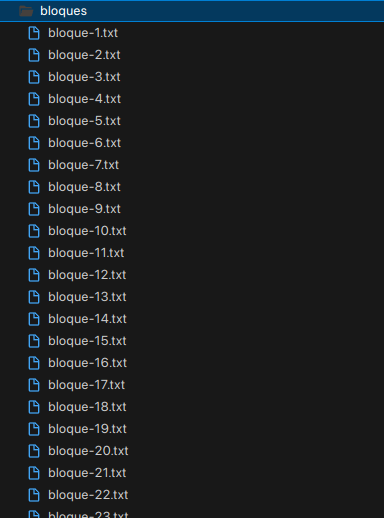

Grupo 4 | Proyecto 2 de Base de Datos II (CS2042) | UTEC
# Búsqueda y Recuperación de la Información
## Integrantes y roles
|            Integrante           |  Rol  |
|:-----------------------------------:|:---------:|
|  Arteaga Montes, Stuart Diego [@SDAM26](https://github.com/SDAM26)     |  Backend  |
|    Cahuana Condori, Kelvin Andreí [@andrewkc](https://github.com/andrewkc) |  Backend  |
|   Callinapa Chunga, Johan Fabian [@johancalli](https://github.com/johancalli)     |  Frontend  |
|   Rivas Chavez, Dimael Antonio [@artrivas](https://github.com/artrivas)       | Backend  |

## 1. Introducción
### Descripción de los datos
Los datos obtendidos para este proyecto han sido obtenidos de la plataforma de Kaggle [Fashion Product Images Dataset](https://www.kaggle.com/datasets/paramaggarwal/fashion-product-images-dataset/data).
Este dataset cuenta con imágenes, múltiples atributos de etiqueta que describen el producto que se ingresó y también con texto descriptivo que comenta las características del producto.

### Librerías utilizadas
* Pandas: Para procesar la data de los archivos csv.
* Psycopg2: Para la conexión entre nuestro backend con la base de datos.
* Nltk: Nos proporciona herramientas y recursos para trabajar con datos de lenguaje natural.
* Fastapi: Para el desarrollo del backend
  
## 2. Backend:
### Construcción del índice invertido
* Invert Index
```python
class InvertIndex:
    def __init__(self, index_file, abstracts_por_bloque=10000, dataFile=""):
        self.index_file = index_file
        self.index = {}
        self.idf = {}
        self.length = {}
        self.BLOCK_LIMIT = abstracts_por_bloque
        self.lista_de_bloques = []
        self.data_path = data_path  # Updated data path
        self.path_index = path_index  # Updated path to index file
    ...
    def SPIMIConstruction(self, n):
        data = self.loadData().head(n)

        dictTerms = defaultdict(list)
        block_n = 1

        for idx, row in data.iterrows():
            if idx % 20000 == 0: print("Estamos en el index ", idx)
            abstract = row["concatenated"]
            docID = row["id"]
            tokensAbstract = preprocesar_textos(abstract)
            #Crear postingList
            term_freq = defaultdict(int)
            for term in tokensAbstract:
                term_freq[term] += 1

            for term, freq in term_freq.items():
                if sys.getsizeof(dictTerms) > self.BLOCK_LIMIT:
                    sorted_block = sorted(dictTerms.items(), key=itemgetter(0))
                    block_name = "bloque-"+str(block_n)+".txt"
                    block_path = os.path.join(blocks_dir, block_name)
                    with open(block_path, "w") as file_part:
                        json.dump(sorted_block, file_part, indent=2)
                    sorted_block = {} #clear
                    block_n += 1
                    dictTerms = defaultdict(list) #clear
                dictTerms[term].append((docID, freq))

        if dictTerms:
            sorted_block = sorted(dictTerms.items(), key=itemgetter(0))
            block_name = "bloque-"+str(block_n)+".txt"
            block_path = os.path.join(blocks_dir, block_name)
            with open(block_path, "w") as file_part:
                json.dump(sorted_block, file_part, indent=2)
            dictTerms = defaultdict(list)
    ...
```
* Método para obtener los k vecinos más cercanos
```python

    def retrieve_k_nearest(self, query, k):
        start_time = time.time()
        data = self.loadData()
        query = preprocesar_textos(query)
        index_data = self.load_Index()
        cos_to_evaluar = defaultdict(dict)
        idf_query=defaultdict(float)
        query_tfidf = []

        for term in query:
            term_data = self.binary_search(term, index_data)
            if term_data is None:
                continue

            idf_query[term] = round(math.log10((len(data)/len(term_data)) + 1),4)

            for docId_tfidfin in term_data:
                docId = docId_tfidfin.split(",")[0]
                tf_idf = docId_tfidfin.split(",")[1]
                cos_to_evaluar[docId][term] = tf_idf
                #va guardando en cada doc, el tf idf en orden de los querys keywords

            tf_ = calculate_tf(term, query)
            idf_ = idf_query[term]
            query_tfidf.append(tf_*idf_)

        #Crear vectores caracteristicos
        cosine_docs = defaultdict(list)

        for docId in cos_to_evaluar:
            for term in query:
                if term in cos_to_evaluar[docId]:
                    cosine_docs[docId].append(float(cos_to_evaluar[docId][term]))
                else:
                    cosine_docs[docId].append(0)

        scores = self.cos_Similarity(query_tfidf, cosine_docs)

        # Ordenar los documentos por puntuación de similitud de coseno en orden descendente
        scores = sorted(scores.items(), key=lambda kv: kv[1], reverse=True)
        scores = scores[:k]

        temp = []
        scores_values = []
        for result in scores:
            temp.append(result[0])
            scores_values.append(result[1])


        # INDICES para hallar en el dataframe
        matching_indices = data.loc[data["id"].isin(temp)].index
        end_time = time.time()

        execution_time = round((end_time - start_time) * 1000, 3) # ms

        return matching_indices, scores_values, execution_time
```
### Manejo de memoria secundaria
* Merge blocks
```python
 def merge(self, block1, block2):
        merge_final = OrderedDict()

        for term, ids in block1.items():
            if term in merge_final:
                merge_final[term]+= ids
            else:
                merge_final[term] = ids

        for term, ids in block2.items():
            if term in merge_final:
                merge_final[term]+= ids
            else:
                merge_final[term] = ids
        bloque_ordenado = OrderedDict(sorted(merge_final.items(), key=lambda x: x[0]))
        return bloque_ordenado
```
* Index blocks
```python
#Se encarga de hacer el merge de blocks, e indexar
    def index_blocks(self):
        blocks = []
        files = self.listFiles()
        for file_path in files:
            with open(file_path, 'r', encoding='utf-8') as file:
                block = json.load(file)
                blocks.append(block)


        while 1 < len(blocks):
            merged_blocks = []
            for i in range(0,len(blocks), 2):
                if i+1 <len(blocks): #si ya no hay mas con que agarrar, o sea el ultimo
                    combinados = self.merge(dict(blocks[i]), dict(blocks[i+1]))
                    merged_blocks.append(combinados)
                else:#solo append al final
                    merged_blocks.append(blocks[i])
            blocks = merged_blocks #actualiza el nuevo merge
        ordenar_merge = OrderedDict(sorted(blocks[0].items(), key=lambda x: x[0]))

        return ordenar_merge

```


### Diseño del índice con PostgreSQL
```python
def create_index(tablename='product'):
    conn = psycopg2.connect(
        host=getenv("HOST"),
        port=getenv("PORT"),
        dbname=getenv("DBNAME"),
        user=getenv("USER"),
        password=getenv("PASSWORD")
    )

    cursor = conn.cursor()
    cursor.execute('CREATE EXTENSION IF NOT EXISTS pg_trgm;')

    cursor.execute(f"ALTER TABLE {tablename} ADD COLUMN indexed tsvector;")
    cursor.execute(f"""UPDATE {tablename} SET indexed = T.indexed FROM (
                    SELECT id, setweight(to_tsvector('english', name), 'A') || setweight(to_tsvector('english', content), 'B') AS indexed FROM {tablename}
                   ) AS T WHERE {tablename}.id = T.id;""")
    cursor.execute('CREATE INDEX IF NOT EXISTS content_idx_gin ON product USING gin (indexed);')

    conn.commit()
    cursor.close()
    conn.close()
```
## 3. Frontend:
### Screenshots de la GUI


* Fetch Data
```javascript
async function fetchData() {
    const query = document.getElementById('queryInput').value;
    const k = parseInt(document.getElementById('kInput').value);
    const method = document.getElementById('methodSelector').value;

    if (!query || isNaN(k)) {
        alert("Por favor, completa todos los campos.");
        return;
    }

    const apiUrl = `${BASE_URL}${method}`;
    const payload = {
        query: query,
        k: k
    };

    try {
        const response = await fetch(apiUrl, {
            method: 'POST',
            headers: {
                'Content-Type': 'application/json',
            },
            body: JSON.stringify(payload),
        });

        if (response.ok) {
            const data = await response.json();

            // Control de visibilidad para el tiempo de ejecución
            const executionTimeContainer = document.getElementById("execution-time-container");
            if (data.execution_time) {
                executionTimeContainer.style.display = "block";
                executionTimeContainer.innerText = `Tiempo de ejecución: ${data.execution_time}`;
            } else {
                executionTimeContainer.style.display = "none";
            }

            // Control de visibilidad para el contenedor de resultados
            const resultContainer = document.getElementById('resultContainer');
            if (data.content && data.content.length > 0) {
                resultContainer.style.display = "block";
                resultContainer.innerHTML = '';

                data.content.forEach(([id, name, content, rank]) => {
                    const resultItem = document.createElement('div');
                    resultItem.className = 'result-item';

                    const nameProduct = document.createElement('p');
                    nameProduct.textContent = `Nombre: ${name}`;
                    resultItem.appendChild(nameProduct);

                    const contentElement = document.createElement('p');
                    contentElement.textContent = `Contenido: ${content}`;
                    resultItem.appendChild(contentElement);

                    const similitude = document.createElement('p');
                    similitude.textContent = `Similitud: ${rank}`;
                    resultItem.appendChild(similitude);

                    if (imageMap[id]) {
                        const imageElement = document.createElement('img');
                        imageElement.src = imageMap[id];
                        imageElement.alt = `Imagen para ID ${id}`;
                        imageElement.width = 100; // o cualquier otro tamaño que prefieras
                        resultItem.appendChild(imageElement);
                    }

                    resultContainer.appendChild(resultItem);
                });

            } else {
                resultContainer.style.display = "none";
            }

        } else {
            alert('Error al realizar la consulta');
        }
    } catch (error) {
        console.error('Hubo un problema con la operación fetch:', error);
    }
}
```

## 4. Experimentación
### Tablas y gráficos de los resultados
Tiempo de ejecución promedio en ms.
| N (registros) | PostgreSQL Index | MyIndex |
|-----------|-----------|-----------|
| 1000   |  1.351 ms   |  141.44 ms |
| 2000   |  2.664 ms  |  154.774 ms   |
| 4000   |  4.060 ms |  162.761 ms |
| 8000   |  9.645 ms  |  169.530 ms  |
| 16000   | 17.976 ms  | 175.382 ms|
| 32000   |  34.365 ms |   182.124 ms|
| 38000   |  39.454 ms|   186.397 ms|
| 44424   |  45.033 ms |  190.282 ms  |


### Conclusión
* Se realizó un uso de memoria eficiente para la construción del índice invertido
* Se creo el índice de postgres considerando distintos pesos, se dio más peso al nombre del producto que al contenido (todos los demás campos concatenados).
* Al realizar la comparación de tiempos de ejecución se evidencio que el índice de postgres es mejor que el nuestro.
